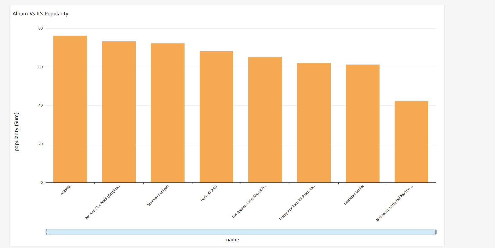

# Spotify 2024 Bollywood Albums Analytics 

In this project, I have built End to End ETL pipeline for analyzing Top 8 2024 Bollywood Albums from spotify api provided using [RapidApi](https://rapidapi.com/Glavier/api/spotify23). This project is entirely built on AWS.

### AWS Services Used:

* S3
* EC2
* Lambda
* apache-airflow-providers-amazon
* Redshift
* QuickSight

## Final QuickSight Dashboard generated

  

